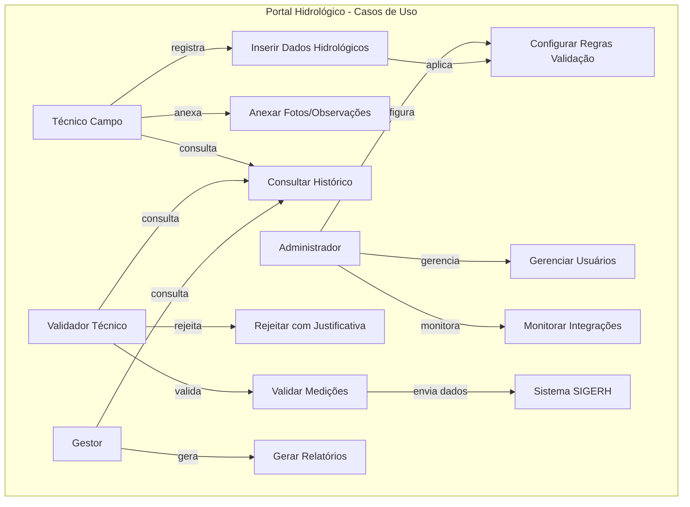
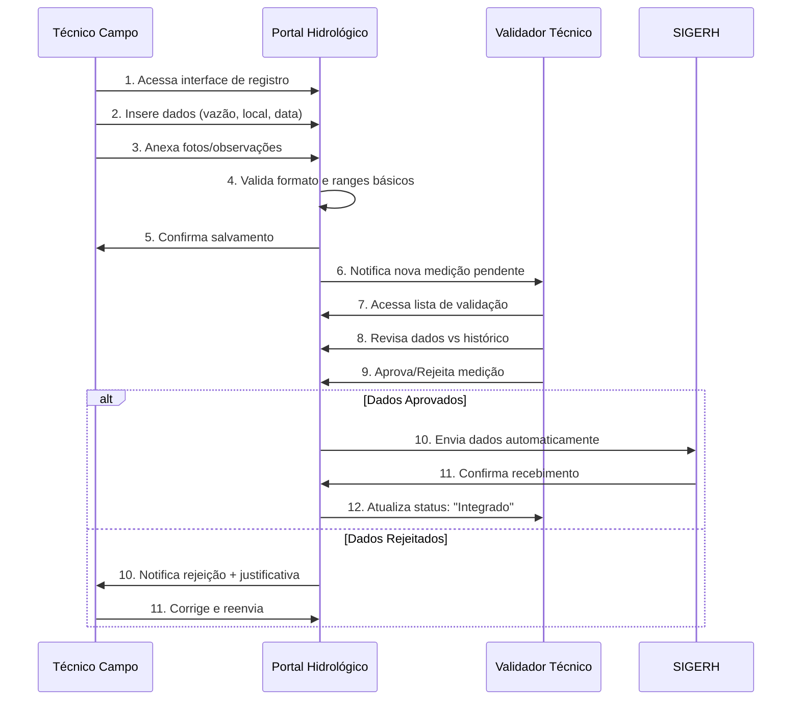
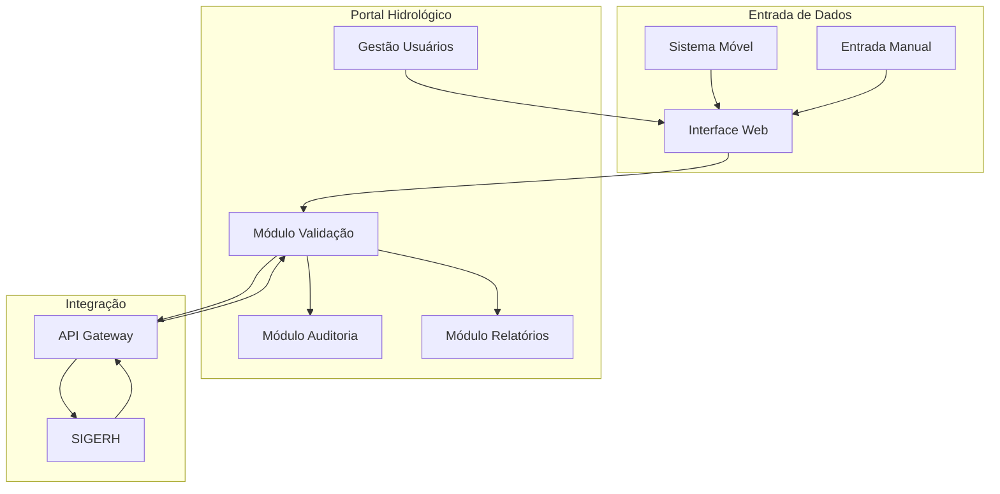

# PRD - Portal Hidrológico
## Documento de Requisitos de Produto (PRD)

**Versão:** 1.0.3  
**Data:** 2024-12-21  
**Autor:** COGERH Dev  
**Aprovação:** Aprovação final pela GEOPE; validação funcional pela GEMON (por perfis no schema de aprovação).  

---

## 1. Sumário Executivo

### 1.1 Visão do Produto
O Portal Hidrológico é uma plataforma web corporativa destinada a facilitar o registro, validação e publicação de dados hidrológicos coletados no estado do Ceará. O portal atende principalmente técnicos de campo, gestores da COGERH e parceiros institucionais, oferecendo interface intuitiva para inserção de medições, validação técnica e consulta de informações hidrológicas históricas e atuais.

### 1.2 Objetivos de Negócio
- **Centralizar** dados hidrológicos de múltiplas fontes em uma plataforma única
- **Padronizar** processos de coleta, validação e publicação conforme normas técnicas
- **Melhorar** eficiência operacional reduzindo retrabalho e tempo de validação
- **Facilitar** tomada de decisão estratégica com dados confiáveis e atualizados
- **Integrar** com SIGERH para alimentação automática do sistema corporativo

### 1.3 Indicadores de Sucesso
- Redução de 40% no tempo médio de validação de dados hidrológicos
- 95% de aprovação dos usuários técnicos em pesquisa de usabilidade
- Integração com SIGERH funcionando em até 5 segundos por transação
- Zero perda de dados durante o processo de migração

---

## 2. Contexto & Escopo

### 2.1 Contexto Organizacional
A COGERH, como órgão gestor dos recursos hídricos do Ceará, necessita de plataforma robusta para gerenciar dados hidrológicos provenientes de estações automáticas, coletas manuais e parcerias institucionais. O portal substituirá processos manuais e planilhas dispersas por fluxo digital centralizado.

### 2.2 Interdependências (Não Técnicas)
- **Ecossistema compartilhado**: O Portal Hidrológico coabitará o mesmo ambiente organizacional do Portal Vazões Jaguaribe RMF
- **Fonte de dados comum**: Ambos os portais podem receber dados do mesmo sistema móvel corporativo
- **Integração SIGERH**: Portal Hidrológico enviará dados validados para o SIGERH, sistema corporativo da COGERH

### 2.3 Escopo Funcional
#### Incluído:
- Interface web para registro de dados hidrológicos
- Validação técnica com regras de negócio configuráveis
- Consulta e relatórios de dados históricos
- Integração de envio para SIGERH
- Gestão de usuários e perfis de acesso
- Auditoria de alterações e trilha de dados

#### Excluído:
- Aplicativo móvel nativo (fora do escopo atual)
- Integração direta com estações automáticas (via sistemas existentes)
- Módulos de cobrança ou outorga de água

---

## 3. Stakeholders e Perfis de Usuário

### 3.1 Stakeholders Principais
| Stakeholder | Papel | Responsabilidade |
|-------------|-------|------------------|
| GEOPE | Patrocinador/Aprovador | Aprovação final do produto e decisões operacionais |
| GEMON | Aprovador Funcional | Validação funcional/qualitativa dos requisitos e critérios de aceite |
| Técnicos de Campo | Usuário Operacional | Coleta (mobile) e consulta das próprias categorias/subcategorias; sem curadoria/edição |
| Gestores COGERH | Usuário Consulta | Relatórios gerenciais e tomada de decisão |
| TI COGERH | Owner Técnico | Manutenção, integrações e schema de aprovação |

### 3.2 Perfis de Acesso
- **Administrador**: Gestão completa, configurações e usuários
- **Validador Técnico**: Validação de dados, aprovação de medições
- **Usuário Operacional (Operador Campo)**: Coleta via mobile e consulta limitada às próprias categorias/subcategorias; sem curadoria/edição
- **Consulta**: Visualização de relatórios e dados aprovados

---

## 4. Lista de Requisitos

### 4.1 Requisitos Funcionais

| ID | Requisito | Prioridade | Status | Critério de Aceite | Fonte |
|----|-----------|------------|--------|-------------------|-------|
| PH-REQ-001 | Sistema deve permitir registro de dados hidrológicos via interface web | Alta | Pendente | Interface funcional com campos obrigatórios validados, salvamento em <3s | PRD Original |
| PH-REQ-002 | Validação técnica deve seguir regras de negócio configuráveis por administrador | Alta | Pendente | Regras editáveis via interface admin, aplicação automática, log de validações | PRD Original |
| PH-REQ-003 | Integração com SIGERH deve enviar dados validados automaticamente | **Crítica (P0)** | **Dependente** | **Envio automático em até 5s, retry em falhas, confirmação de recebimento** | **Requisitos COGERH** |
| PH-REQ-004 | Sistema deve gerar relatórios de dados históricos com filtros personalizáveis | Média | Pendente | Relatórios em PDF/Excel, filtros por período/local/tipo, geração em <10s | PRD Original |
| PH-REQ-005 | Auditoria completa de alterações de dados com trilha de usuário | Alta | Pendente | Log completo de quem/quando/o que alterou, consulta por admin | Requisitos COGERH |
| PH-REQ-006 | Interface responsiva para acesso via tablet em campo | Média | Pendente | Layout adaptável, funcional em tablets Android/iOS, offline básico | PRD Original |
| PH-REQ-007 | Gestão de usuários com perfis de acesso diferenciados | Alta | Pendente | CRUD usuários, atribuição perfis, controle de acesso por funcionalidade | PRD Original |
| PH-REQ-008 | **Memorial de cálculo deve ser validado pelas áreas GEMON/GEOPE** | **Crítica (P0)** | **Bloqueado** | **Documentação completa validada e aprovada antes do desenvolvimento** | **Requisitos COGERH** |

### 4.2 Requisitos Não Funcionais (NFRs)

| ID | NFR | Métrica | Critério de Aceite | Owner | Prazo-alvo |
|----|-----|---------|-------------------|-------|------------|
| PH-NFR-001 | Performance de Interface | Responsividade | Interface responsiva para carregamento eficiente **(TBD pela TI)** | TI | Fase 1 |
| PH-NFR-002 | Disponibilidade de Serviço | Uptime | 99,5% de disponibilidade em horário comercial (6h-18h) **(TBD pela TI)** | TI | Fase 1 |
| PH-NFR-003 | Atualização de Dados | Frequência | Dados atualizados no SIGERH após validação **(TBD pela TI)** | TI | Fase 1 |
| PH-NFR-004 | Segurança de Acesso | Autenticação | Login seguro com session timeout em 2 horas de inatividade **(TBD pela TI)** | TI | Fase 1 |
| PH-NFR-005 | Capacidade | Usuários Simultâneos | Suporte adequado a usuários simultâneos sem degradação **(TBD pela TI)** | TI | Fase 1 |

---

## 5. Governança GEOPE e Visibilidade

- A GEOPE é responsável por definir e manter o mapeamento canônico de responsabilidade entre Categoria/Subcategoria Operacional e Gerência Regional, com vigência temporal (início/fim) e trilha de auditoria (quem/quando/o quê).
- Este mapeamento impacta diretamente as políticas de RLS/visibilidade: usuários Operacionais (técnicos de campo) e Validadores somente enxergam/atuam sobre estruturas e subcategorias atribuídas à sua Gerência Regional no período de vigência.
- Alterações de governança devem gerar registro de auditoria e acionar revalidação de caches/visões materializadas, quando aplicável.

### 5.1. Taxonomia Operacional e GR Associadas (Açudes/Seções de Rio)

Observação: Cada item deve possuir GR associada e vigência temporal. Caso a GR esteja pendente, marcar como TBD para definição pela GEOPE via interface de governança.

- Açudes Monitorados:
  - Acarape do Meio — GRMETROPOLITANA
  - Aracoiaba — TBD (definição pela GEOPE; pendência registrada)
  - Banabuiú — GRBANABUIU
  - Castanhão — GRMBJAGUARIBE
  - Curral Velho — GRLITORAL
  - Gavião — GRMETROPOLITANA
  - Joaquim Távora — GRIBIAPABA
  - Lima Campos — GRALTJAGUARIBE
  - Maranguapinho — GRMETROPOLITANA
  - Orós — GRALTJAGUARIBE
  - Pacajus — GRMETROPOLITANA
  - Pacoti — GRMETROPOLITANA
  - Riachão — GRCURU
  - Sítios Novos — GRMETROPOLITANA

- Perenização e Seções de Rio:
  - Liberação do Aracoiaba — GRBANABUIU
  - Liberação do Banabuiú — GRBANABUIU
  - Liberação do Castanhão — GRMBJAGUARIBE
  - Liberação do Lima Campos — GRALTJAGUARIBE
  - Liberação do Orós — GRALTJAGUARIBE

- Observações adicionais:
  - "Chegada em Pacajus" pertence à GRMETROPOLITANA (confirmado).
  - Vigência temporal deve ser respeitada em consultas e telas operacionais.
  - Divergências entre a taxonomia operacional deste PRD e o cadastro canônico no SIGERH devem ser registradas como risco e tratadas em sprint próxima.

---

## 6. Hierarquia de Entregas

### 6.1 Épicos

#### Épico 1: Gestão de Dados Hidrológicos
**Features:**
- Feature 1.1: Registro de Medições
- Feature 1.2: Validação Técnica
- Feature 1.3: Consulta e Relatórios

#### Épico 2: Integração e Interoperabilidade
**Features:**
- Feature 2.1: Integração SIGERH
- Feature 2.2: Auditoria e Trilha

#### Épico 3: Gestão de Usuários e Segurança
**Features:**
- Feature 3.1: Autenticação e Autorização
- Feature 3.2: Gestão de Perfis

### 6.2 Histórias de Usuário (User Stories)

#### Feature 1.1: Registro de Medições
**US-PH-001**: Como técnico de campo, quero registrar dados de vazão via interface web para que as medições sejam centralizadas no sistema corporativo.
- **Critérios de Aceite:**
  - Interface com campos obrigatórios: data, hora, local, vazão, responsável
  - Validação de formato e valores dentro de ranges aceitáveis
  - Confirmação visual de salvamento com mensagem de sucesso
  - Tempo de salvamento inferior a 3 segundos

**US-PH-002**: Como técnico de campo, quero anexar fotos e observações às medições para que haja registro visual e contextual dos dados coletados.
- **Critérios de Aceite:**
  - Upload de até 3 fotos por medição (máx. 5MB cada)
  - Campo de observações com até 500 caracteres
  - Prévia das imagens antes do envio
  - Metadados de geolocalização preservados quando disponíveis

#### Feature 1.2: Validação Técnica
**US-PH-003**: Como validador técnico, quero revisar e aprovar dados coletados para que apenas informações confiáveis sejam enviadas ao SIGERH.
- **Critérios de Aceite:**
  - Lista de medições pendentes de validação com filtros
  - Interface de comparação com dados históricos do local
  - Botões de aprovar/rejeitar com campo obrigatório de justificativa
  - Notificação automática ao técnico de campo em caso de rejeição

**US-PH-004**: Como administrador, quero configurar regras de validação automática para que o sistema identifique valores suspeitos automaticamente.
- **Critérios de Aceite:**
  - Interface para definir ranges aceitáveis por estação
  - Configuração de alertas para variações superiores a X% da média histórica
  - Regras ativas/inativas por período (ex: época seca vs chuvosa)
  - Log de aplicação de regras automáticas

#### Feature 2.1: Integração SIGERH
**US-PH-005**: Como gestor COGERH, quero que dados validados sejam enviados automaticamente ao SIGERH para que não haja retrabalho de digitação.
- **Critérios de Aceite:**
  - Envio automático em até 5 segundos após validação final
  - Confirmação de recebimento do SIGERH com protocolo
  - Retry automático em caso de falha (até 3 tentativas)
  - Dashboard com status de sincronização

#### Feature 3.1: Autenticação e Autorização
**US-PH-006**: Como administrador, quero gerenciar usuários e seus perfis de acesso para que cada pessoa tenha permissões adequadas às suas funções.
- **Critérios de Aceite:**
  - CRUD completo de usuários
  - Atribuição de perfis: Admin, Validador, Operador, Consulta
  - Controle de acesso por funcionalidade
  - Relatório de usuários ativos/inativos

---

## 7. Diagramas

### 7.1 Diagrama de Casos de Uso

### 7.2 Fluxo Principal - Registro e Validação

### 7.3 Arquitetura de Fluxo de Dados

---

## 8. Riscos e Premissas

### 8.1 Riscos
| ID | Risco | Prob. | Impacto | Mitigação | Resp. |
|----|-------|-------|---------|-----------|-------|
| R-PH-001 | **Memorial de cálculo não validado a tempo** | Alta | Crítico | Priorizar validação com GEMON/GEOPE antes do desenvolvimento; agendar comitê | GEMON/GEOPE |
| R-PH-002 | Mapeamento RLS/visibilidade por regional não validado por subcategoria | Média | Alto | Registrar pendência e validar mapeamento canônico categoria/subcategoria→regional; owner TI | TI |
| R-PH-003 | Divergência entre Taxonomia/GR operacional do PRD e cadastro canônico SIGERH | Média | Alto | Implementar rotina de reconciliação e revisão de governança GEOPE; registrar exceções e ajustar RLS | TI + GEOPE |

### 8.2 Premissas
- A validação do memorial de cálculo será concluída antes do início da implementação das regras de negócio dependentes (P0).
- O fluxo de aprovação por GEMON/GEOPE ocorrerá em até 10 dias úteis após submissão da versão de memorial de cálculo.
- Infraestrutura adequada será provisionada pela TI COGERH
- Usuários terão treinamento antes do go-live
- SIGERH manterá APIs estáveis durante integração
- Dados históricos estarão disponíveis para migração
- Conectividade de internet estável nos pontos de coleta
- Sazonalidade: para feriados, considerar calendário nacional + feriados do Ceará; sem anexo de calendário (definição por fase, TBD pela TI)

---

## 9. Roadmap

### 9.1 Fases de Entrega

#### Fase 1: MVP (8-10 semanas)
- **Semanas 1-2**: Definição e aprovação do memorial de cálculo
- **Semanas 3-5**: Desenvolvimento da interface de registro básico
- **Semanas 6-7**: Implementação da validação técnica
- **Semanas 8-9**: Integração básica com SIGERH
- **Semana 10**: Testes e ajustes

#### Fase 2: Funcionalidades Avançadas (6-8 semanas)
- **Semanas 1-3**: Módulo de relatórios e consultas avançadas
- **Semanas 4-5**: Auditoria completa e trilha de dados
- **Semanas 6-7**: Interface responsiva para tablets
- **Semana 8**: Testes de integração

#### Fase 3: Otimização e Go-Live (4-6 semanas)
- **Semanas 1-2**: Testes de performance e carga
- **Semana 3**: Treinamento de usuários
- **Semana 4**: Deploy em produção
- **Semanas 5-6**: Monitoramento e ajustes pós go-live

### 9.2 Marcos Principais
- **Marco 1**: Memorial de cálculo aprovado (P0)
- **Marco 2**: MVP em ambiente de testes
- **Marco 3**: Integração SIGERH homologada
- **Marco 4**: Treinamento de usuários concluído
- **Marco 5**: Go-live em produção

---

## 10. Matriz de Rastreabilidade

| Item | Relacionamentos |
|------|-----------------|
| PH-REQ-003 (Integração SIGERH) | Depende de PH-REQ-008 (Memorial P0). Testes: Integração-01, Logs-01 |
| PH-REQ-008 (Memorial de Cálculo P0) | Bloqueia histórias US-PH-0XX dependentes de cálculo. Owner: GEMON (validação funcional) / GEOPE (aprovação final) |
| PH-NFR-001..005 | Owner: TI; Prazo-alvo: Fase 1; Critérios de aceite marcados como "TBD pela TI" |

### 10.1 Requisitos vs Stakeholders

| Requisito | GEMON | GEOPE | Técnicos | Gestores | TI |
|-----------|-------|-------|----------|----------|-----|
| PH-REQ-001 | ✓ | ✓ | ✓ | - | ✓ |
| PH-REQ-002 | ✓ | ✓ | ✓ | - | ✓ |
| PH-REQ-003 | ✓ | ✓ | - | ✓ | ✓ |
| PH-REQ-004 | ✓ | ✓ | ✓ | ✓ | - |
| PH-REQ-005 | ✓ | ✓ | - | ✓ | ✓ |
| PH-REQ-006 | - | ✓ | ✓ | - | ✓ |
| PH-REQ-007 | ✓ | ✓ | - | - | ✓ |
| PH-REQ-008 | ✓ | ✓ | - | - | - |

### 10.2 Requisitos vs User Stories

| Requisito | User Stories |
|-----------|--------------|
| PH-REQ-001 | US-PH-001, US-PH-002 |
| PH-REQ-002 | US-PH-003, US-PH-004 |
| PH-REQ-003 | US-PH-005 |
| PH-REQ-007 | US-PH-006 |

### 10.3 Critérios de Aceite vs Testes

| Critério | Tipo de Teste | Responsável |
|----------|---------------|-------------|
| Interface funcional com salvamento <3s | Teste de Performance | QA + Dev |
| Regras editáveis via interface admin | Teste Funcional | QA |
| Envio automático SIGERH em 5s | Teste de Integração | QA + TI |
| Relatórios PDF/Excel em <10s | Teste de Performance | QA |
| Controle acesso por funcionalidade | Teste de Segurança | QA + Security |

---

## 11. Histórico de Revisões

| Versão | Data | Autor | Alterações |
|--------|------|-------|------------|
| 1.0.0 | 2024-12-20 | COGERH Dev | Criação inicial do PRD consolidado |
| 1.0.1 | 2024-12-20 | COGERH Dev | Ajuste de governança: aprovadores por gerência (GEMON/GEOPE) e referência a schema de perfis |
| 1.0.2 | 2024-12-20 | COGERH Dev | Frase de aprovação padronizada; stakeholders revisados (GEOPE/GEMON); perfil Usuário Operacional formalizado; sazonalidade (feriados CE + nacional); pendência RLS por regional; atualização da matriz de rastreabilidade |
| 1.0.3 | 2024-12-21 | COGERH Dev | Inclusão de nova seção 5 (Governança GEOPE e Visibilidade) e 5.1 (Taxonomia Açudes/Seções de Rio e GR associadas); pendência de Aracoiaba como TBD; nota "Chegada em Pacajus" ∈ GRMETROPOLITANA; adição do risco R-PH-003 (divergência Taxonomia/GR vs SIGERH); alinhamento de ator Técnico de Campo nos diagramas |

---

## 12. Anexos

### 12.1 Glossário
- **SIGERH**: Sistema Integrado de Gestão de Recursos Hídricos da COGERH
- **GEMON**: Gerência de Monitoramento da COGERH
- **GEOPE**: Gerência de Operação da COGERH
- **Vazão**: Volume de água que passa por uma seção transversal por unidade de tempo
- **Memorial de Cálculo**: Documentação técnica que detalha métodos e parâmetros de cálculo hidrológico

### 12.2 Referências Normativas
- IEEE 29148: Standard for Software Requirements Specifications
- Metodologia BMAD para alinhamento de modelo de negócio
- Normas técnicas COGERH para dados hidrológicos

---

**Status do Documento**: ✅ Aguardando Aprovação GEMON/GEOPE  
**Próximos Passos**: Validação do memorial de cálculo e aprovação para desenvolvimento  
**Contato**: COGERH Dev - israel.evangelista@cogerh.com.br