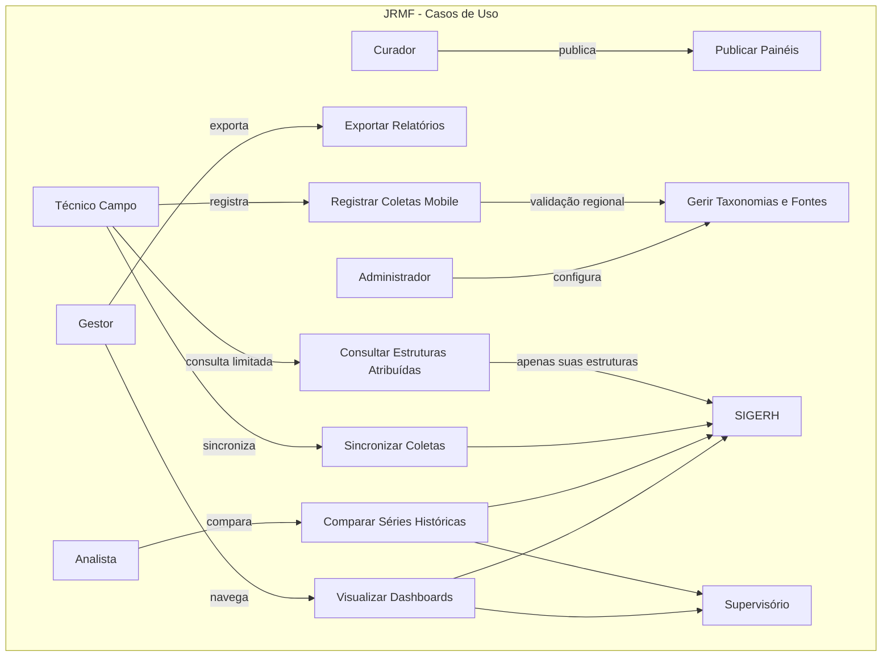
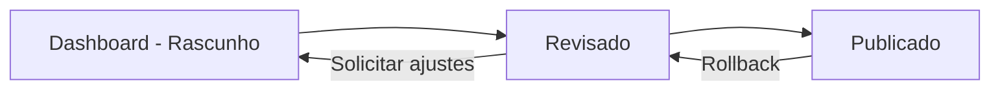
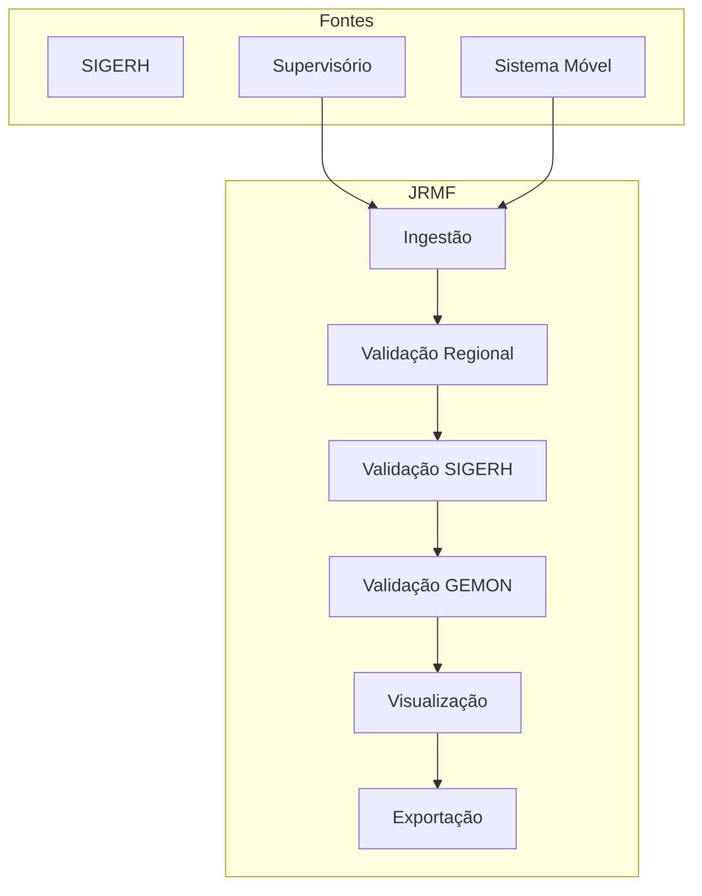
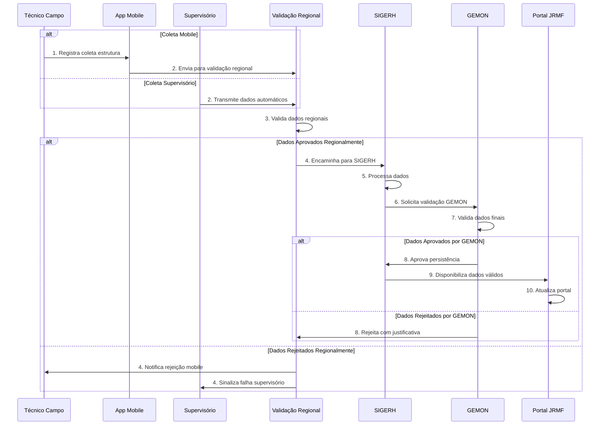

# PRD - Portal Vazões Jaguaribe RMF (JRMF)
## Documento de Requisitos de Produto (PRD)

**Versão:** 1.0.4  
**Data:** 2025-08-18  
**Autor:** COGERH Dev  
**Aprovação:** Aprovação final pela GEOPE; validação funcional pela GEMON (por perfis no schema de aprovação).  

---

## 1. Sumário Executivo

### 1.1 Visão do Produto
O Portal Vazões Jaguaribe RMF (JRMF) é uma aplicação web focada em disponibilizar, para gestores e sociedade, informações de vazões provenientes da Bacia do Jaguaribe e Região Metropolitana de Fortaleza. O portal prioriza visualização de séries históricas, gráficos interativos e painéis resumidos, recebendo dados de múltiplas fontes institucionais (incluindo SIGERH e Supervisório) e assegurando transparência e confiabilidade.

### 1.2 Objetivos de Negócio
- **Disponibilizar** dados de vazões com clareza e confiabilidade para apoio a decisões
- **Transparência** pública por meio de painéis e relatórios acessíveis
- **Consolidar** dados de diferentes origens (SIGERH, Supervisório, sistema móvel)
- **Agilizar** a análise por meio de gráficos e comparativos temporais

### 1.3 Indicadores de Sucesso
- 90% dos usuários-alvo consideram os dashboards claros e úteis
- Atualização de dados refletida no portal em até 10 minutos após publicação na origem
- Zero divergência de valores em relação às fontes oficiais após validação

---

## 2. Contexto & Escopo

### 2.1 Contexto Organizacional
O JRMF é uma iniciativa da COGERH para aumentar a transparência e facilitar a tomada de decisão com base nas vazões monitoradas. O portal consolidará dados em visão orientada a consumo (dashboards, gráficos e relatórios), preservando a rastreabilidade das fontes.

### 2.2 Interdependências (Não Técnicas)
- **Ecossistema compartilhado**: Coabita o mesmo ambiente organizacional do Portal Hidrológico
- **Fonte de dados comum**: Pode consumir dados oriundos do mesmo sistema móvel corporativo
- **Integrações institucionais**: Recebe dados do SIGERH e do Supervisório

### 2.3 Escopo Funcional
#### Incluído:
- Dashboards interativos de vazões por bacia, sub-bacia e estação
- Séries históricas com filtros temporais e comparativos
- Indicadores e alertas de situação (ex.: abaixo/igual/acima de médias)
- Exportação de gráficos e dados (CSV, PNG, PDF)
- Página pública de transparência com metodologia e fontes

#### Excluído:
- Edição manual de medições (origem controlada pelos sistemas fonte)
- Planejamento operacional (fora do escopo do JRMF)

---

## 3. Stakeholders e Perfis de Usuário

### 3.1 Stakeholders Principais
| Stakeholder | Papel | Responsabilidade |
|-------------|-------|------------------|
| GEOPE | Patrocinador/Aprovador | Aprovação final do produto e definição de indicadores operacionais |
| GEMON | Aprovador Funcional | Validação funcional/qualitativa de indicadores e critérios de aceite |
| Gestores Públicos | Usuário Consulta | Análise de situação e tomada de decisão |
| Sociedade | Usuário Consulta | Transparência de dados |
| TI COGERH | Owner Técnico | Manutenção, integrações e schema de aprovação |

### 3.2 Perfis de Acesso
- **Administrador**: Gestão de taxonomias, fontes e publicações
- **Curador de Dados**: Validação editorial e publicação de painéis
- **Usuário Operacional (Técnicos de Campo)**: Coleta (mobile) e consulta das próprias categorias/subcategorias; sem curadoria/edição editorial; inserções customizadas via interface permanecem exclusivas de TI/Curadoria
- **Consulta Interna/Externa**: Acesso a dashboards e relatórios

---

## 4. Lista de Requisitos

### 4.1 Requisitos Funcionais

| ID | Requisito | Prioridade | Status | Critério de Aceite | Fonte |
|----|-----------|------------|--------|-------------------|-------|
| JRMF-REQ-001 | Exibir dashboards interativos de vazões por recorte geográfico | Alta | Pendente | Dashboard com filtros por bacia/sub-bacia/estação; atualização em tempo real | PRD Original |
| JRMF-REQ-002 | Mostrar séries históricas com comparativos por período | Alta | Pendente | Gráficos com seleção de intervalos e overlays de média/máxima/mínima | PRD Original |
| JRMF-REQ-003 | Receber dados do SIGERH e do Supervisório | **Crítica (P0)** | **Dependente** | **Dados consistentes com fontes após validação; registro de origem/time-stamp** | **Requisitos COGERH** |
| JRMF-REQ-004 | Exportar dados e gráficos em CSV/PNG/PDF | Média | Pendente | Exportação em até 10s, metadados de período e fonte juntos | PRD Original |
| JRMF-REQ-005 | Publicar página metodológica e de fontes de dados | Média | Pendente | Página pública com metodologia, periodicidade e limitações | PRD Original |
| JRMF-REQ-006 | Curadoria e publicação de painéis | Alta | Pendente | Fluxo com rascunho→revisado→publicado; auditoria de alterações | Requisitos COGERH |
| JRMF-REQ-007 | **Memorial de cálculo (indicadores/alertas) validado por GEMON/GEOPE** | **Crítica (P0)** | **Bloqueado** | **Documentação e validação dos indicadores e thresholds** | **Requisitos COGERH** |

### 4.2 Requisitos Não Funcionais (NFRs)

| ID | NFR | Métrica | Critério de Aceite | Owner | Prazo-alvo |
|----|-----|---------|-------------------|-------|------------|
| JRMF-NFR-001 | Tempo de atualização | Atualização | Dados refletidos no portal após atualização na origem **(TBD pela TI)** | TI | Fase 1 |
| JRMF-NFR-002 | Disponibilidade | Uptime | Disponibilidade em horário comercial (6h-18h) **(TBD pela TI)** | TI | Fase 1 |
| JRMF-NFR-003 | Acessibilidade | WCAG | Conformidade com WCAG 2.1 AA nas páginas públicas **(TBD pela TI)** | TI | Fase 1 |
| JRMF-NFR-004 | Exportação | Desempenho | Geração de arquivos para períodos de 5 anos **(TBD pela TI)** | TI | Fase 1 |

---

## 5. Hierarquia de Entregas

### 5.1 Épicos

#### Épico 1: Visualização e Exploração de Dados
**Features:**
- Feature 1.1: Dashboards por recorte geográfico
- Feature 1.2: Séries históricas e comparativos

#### Épico 2: Curadoria e Publicação
**Features:**
- Feature 2.1: Workflow editorial
- Feature 2.2: Página de metodologia e fontes

#### Épico 3: Interoperabilidade
**Features:**
- Feature 3.1: Consumo de dados SIGERH/Supervisório
- Feature 3.2: Exportações e compartilhamento

### 5.2 Histórias de Usuário

#### Feature 1.1: Dashboards
**US-JRMF-001**: Como gestor, quero navegar por bacia/sub-bacia/estação para analisar a situação de vazões.
- Critérios de Aceite:
  - Filtros encadeados por recorte geográfico
  - KPIs no topo (mín/méd/máx no período)
  - Interação fluida sem recarregar a página

#### Feature 1.2: Séries históricas
**US-JRMF-002**: Como analista, quero comparar séries históricas em diferentes períodos para avaliar tendências.
- Critérios de Aceite:
  - Seleção de períodos customizáveis
  - Overlays de estatísticas (média/mín/máx) e thresholds
  - Exportação do gráfico e dos dados filtrados

#### Feature 2.1: Workflow editorial
**US-JRMF-003**: Como curador de dados, quero revisar e publicar painéis com histórico de alterações para garantir qualidade.
- Critérios de Aceite:
  - Estados rascunho→revisado→publicado
  - Registro de alterações com autor e timestamp
  - Possibilidade de rollback para versão anterior

#### Feature 3.1: Interoperabilidade
**US-JRMF-004**: Como gestor, quero que o portal exiba dados consistentes com o SIGERH/Supervisório para evitar discrepâncias.
- Critérios de Aceite:
  - Exibição com indicações de fonte e horário da última atualização
  - Auditoria de ingestão
  - Sinalização de indisponibilidade da fonte

---

## 6. Diagramas

### 6.1 Casos de Uso (Mermaid)

### 6.2 Fluxo Editorial

### 6.3 Fluxo de Consumo de Dados (alto nível)

### 6.4 Diagrama de Sequência - Fluxo de Validação e Persistência

---

## 7. Governança GEOPE e Visibilidade

- Interface de governança (GEOPE): Definição de responsabilidade categoria/subcategoria → Gerência Regional com vigência por período (data início obrigatório; data fim opcional, podendo ser aberta até revogação). Registro de trilha de auditoria para cada mudança.
- Efeito em RLS: O mapeamento vigente determina visibilidade de dados e estruturas por regional (RLS) e quais estruturas aparecem para o Usuário Operacional (Técnico de Campo) no mobile.
- Consulta Limitada (Usuário Operacional): Exibe somente estruturas atribuídas ao perfil da sua gerência regional; sem curadoria/edição editorial; inserções manuais seguem exclusivas de TI/Curadoria.
- Nota de governança: Pendência de GR para "Chegada em Pacajus" resolvida — pertence à **GRMETROPOLITANA** (vigente; refletida na seção 7.1 e alinhada ao PRD do Portal Hidrológico).

### 7.1. Taxonomia Operacional e GR Associadas

#### Categorias e Subcategorias do JRMF
As estruturas do Portal JRMF são organizadas nas seguintes categorias/subcategorias. A atribuição de Gerência Regional (GR) responsável é configurável via interface de governança GEOPE:

| Categoria | Subcategoria | GR Responsável (Configurável) |
|-----------|--------------|-------------------------------|
| **Abastecimento Público** | Geral | A definir via GEOPE |
| **Adutora** | Adutora do Acarape | A definir via GEOPE |
| **Canal** | Canal do Trabalhador | A definir via GEOPE |
| **Eixão** | Geral | A definir via GEOPE |
| **CAC** | Cinturão das Águas do Ceará | A definir via GEOPE |
| **Indústrias** | Geral | A definir via GEOPE |
| **SAP** | Sistema de Abastecimento Público | A definir via GEOPE |
| **Irrigação** | Geral | A definir via GEOPE |
| **Adutora** | Orós-Feiticeiro | A definir via GEOPE |
| **Adutora** | Orós-Lima Campos | A definir via GEOPE |
| **Adutora** | Sítios Novos Pecém | A definir via GEOPE |

**Nota**: "Chegada em Pacajus" foi confirmada como pertencente à **GRMETROPOLITANA**.

#### Observações
- As definições de GR podem ter vigência temporal e histórico de alterações.
- Estruturas podem estar em regiões abrangidas por mais de uma gerência; a responsabilidade pela coleta de dados será definida pontualmente pela GEOPE.
- RLS provisória ou configurações temporárias devem ser validadas antes do go-live.

---

## 8. Riscos e Premissas

### 8.1 Riscos

| ID | Risco | Prob. | Impacto | Mitigação | Resp. |
|----|-------|-------|---------|-----------|-------|
| R-JRMF-001 | Memorial de cálculo GEMON/GEOPE não aprovado | Média | Alto | Engajamento antecipado e iterações curtas; validação técnica preliminar | GEMON/GEOPE + TI |
| R-JRMF-002 | Dados SIGERH/Supervisório com divergências não detectadas | Baixa | Alto | Controle de qualidade em pipeline; auditoria de ingestão; dashboard de integridade | TI |
| R-JRMF-003 | Divergência entre Taxonomia/GR operacional do PRD e cadastro canônico SIGERH | Média | Alto | Implementar rotina de reconciliação e revisão de governança GEOPE; registrar exceções e ajustar RLS | TI + GEOPE |

### 8.2 Premissas
- Todas as estruturas do JRMF podem ter dados provenientes de duas origens: Mobile (coleta em campo) e Sistema Supervisório.
- A persistência oficial ocorre no SIGERH, após validação regional e validação por GEMON; o portal consome somente dados válidos.
- A validação do memorial de cálculo (indicadores e thresholds) será concluída antes da implementação de painéis dependentes (P0).
- O fluxo de aprovação por GEMON/GEOPE ocorrerá em até 10 dias úteis após submissão da versão do memorial de cálculo.
- Fontes institucionais manterão disponibilidade mínima em horário comercial
- Haverá curadoria antes da publicação de dashboards
- Taxonomias geográficas e de estações serão fornecidas pelas áreas
- Sazonalidade: para feriados, considerar calendário nacional + feriados do Ceará; sem anexo de calendário (definição por fase, TBD pela TI)

---

## 9. Roadmap

### 9.1 Fases
- Fase 1 (6-8 semanas): Dashboards básicos + séries históricas
- Fase 2 (4-6 semanas): Workflow editorial + exportações
- Fase 3 (3-4 semanas): Otimizações, acessibilidade, hardening

### 9.2 Marcos
- Marco A: Memorial de Cálculo aprovado (P0)
- Marco B: Primeiros dashboards homologados
- Marco C: Workflow editorial ativo
- Marco D: Página pública de metodologia
- Marco E: Go-live

---

## 10. Matriz de Rastreabilidade

| Item | Relacionamentos |
|------|-----------------|
| JRMF-REQ-003 (Dados SIGERH/Supervisório) | Depende de JRMF-REQ-007 (Memorial P0). Testes: Consistência-01, Auditoria-01 |
| JRMF-REQ-007 (Memorial de Cálculo P0) | Bloqueia US-JRMF-001/002 dependentes de thresholds. Owner: GEMON (validação funcional) / GEOPE (aprovação final) |
| JRMF-NFR-001..004 | Owner: TI; Prazo-alvo: Fase 1; Critérios de aceite marcados como "TBD pela TI" |

### 10.1 Requisitos vs Stakeholders

| Requisito | Stakeholders | User Stories |
|-----------|--------------|--------------|
| JRMF-REQ-001 | GEMON, GEOPE, Gestores | US-JRMF-001 |
| JRMF-REQ-002 | GEMON, Analistas | US-JRMF-002 |
| JRMF-REQ-003 | GEMON, TI | US-JRMF-004 |
| JRMF-REQ-006 | GEOPE, Curadoria | US-JRMF-003 |
| JRMF-REQ-007 | GEMON, GEOPE | US-JRMF-001, US-JRMF-002 |

---

## 11. Histórico de Revisões

| Versão | Data | Autor | Alterações |
|--------|------|-------|------------|
| 1.0.0 | 2024-12-20 | COGERH Dev | Criação inicial do PRD JRMF |
| 1.0.1 | 2024-12-20 | COGERH Dev | Ajuste de governança: aprovadores por gerência (GEMON/GEOPE) e referência a schema de perfis |
| 1.0.2 | 2024-12-20 | COGERH Dev | Frase de aprovação padronizada; stakeholders revisados (GEOPE/GEMON); sazonalidade (feriados CE + nacional); pendência RLS por regional; atualização da matriz de rastreabilidade |
| 1.0.3 | 2024-12-21 | COGERH Dev | Inclusão do ator Técnico de Campo nos casos de uso; atualização do fluxo de consumo com validações Regional→SIGERH→GEMON; seção de governança GEOPE com vigência; inclusão da seção de riscos (R-JRMF-001..003); ajuste de numeração pós-governança; regra de consulta limitada por estruturas atribuídas |
| 1.0.4 | 2025-08-18 | COGERH Dev | Decisão de GR: "Chegada em Pacajus" → GRMETROPOLITANA; nota de governança (seção 7) e referência na 7.1; numeração final (7–12) validada; alinhamento mantido com PRD Portal Hidrológico |

---

## 12. Anexos

> Observação: os relatórios de exemplo estão disponíveis em: d:/Israel/Projetos Clientes/Projetos TRAE/Sistema JRMF/Requisitos/Anexos/Anexos_Documentacao/Relatorios_Exemplos/

### 12.1 Glossário
- **JRMF**: Jaguaribe e Região Metropolitana de Fortaleza
- **Supervisório**: Sistema de supervisão e controle operacional
- **Curadoria**: Atividade de revisão e publicação de conteúdo/dashboards
- **Taxonomia**: Estrutura de classificação (bacia, sub-bacia, estação)

### 12.2 Referências
- IEEE 29148: Requisitos de Software
- Metodologia BMAD
- Diretrizes COGERH para publicação de dados públicos

---

**Status do Documento**: ✅ Aguardando Aprovação GEMON/GEOPE  
**Próximos Passos**: Validar memorial de cálculo e indicadores/thresholds  
**Contato**: COGERH Dev - israel.evangelista@cogerh.com.br